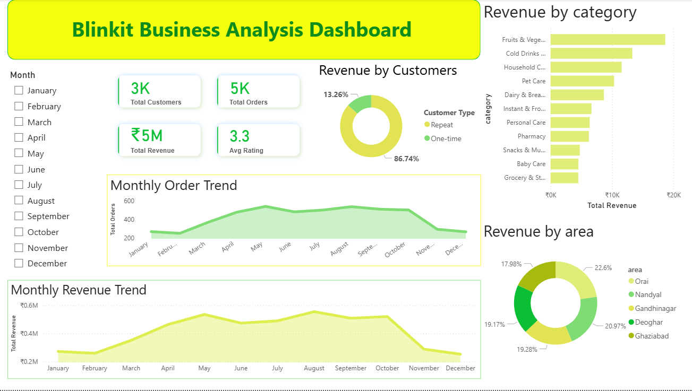
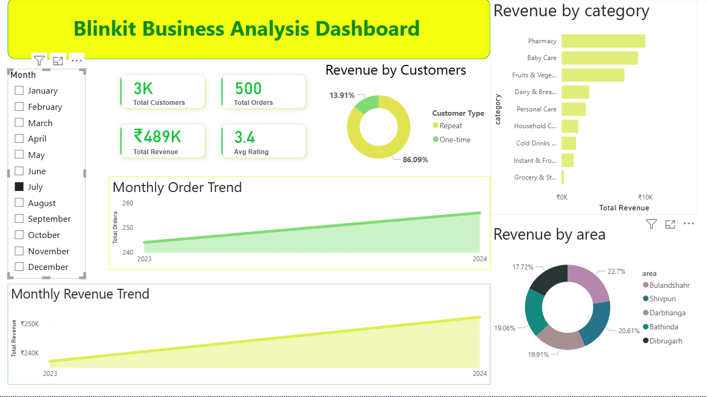

# Blinkit Business Analysis Dashboard

## Project Overview
This project analyzes Blinkit sales data using Python, Pandas, NumPy, and Power BI to uncover business insights related to customer behavior, sales trends, product performance, and revenue analysis.

## The project includes:

- Data cleaning and preprocessing using Python
- Customer analysis
- Revenue trend analysis
- Interactive Power BI dashboard

## Tools & Technologies Used
- Python
- Pandas
- Jupyter Notebook
- Power BI
- CSV Dataset

## Dataset Tables Used
- Customers
- Orders
- Order Items
- Products
- Customer Feedback

## Data Cleaning & Preparation
### Performed using Python in Jupyter Notebook:
- Merged multiple tables
- Handled null values
- Removed unwanted columns
- Fixed data type issues
### Created calculated columns:
- Revenue
- Order Month
- Weekday / Weekend
- Customer Type (Repeat / One-time)

## Key Business Analysis Performed

1. Revenue Analysis
- Total Revenue Generated
- Monthly Revenue Trend
- Revenue by Category
- Revenue by Area

2. Customer Analysis
- Repeat vs One-time Customers
- Average Order Value (AOV)
- Top Revenue Generating Customers
- Customer Segment Analysis

3. Product & Category Analysis
- Best Performing Categories
- Top Selling Products
- Category-wise Revenue Contribution

4. Time-Based Analysis
- Monthly Order Trends
- Weekday vs Weekend Revenue Analysis

5. Customer Feedback Analysis
- Average Customer Rating

## Key Insights
- Repeat customers generated the majority of revenue.
- Revenue peaked during mid-year months.
- Certain product categories consistently outperformed others.
- Weekend sales were slightly lower than weekday sales.
- Customer ratings remained stable around average satisfaction levels.

## Power BI Dashboard Features
- Interactive slicers
- KPI Cards
- Revenue Trend Charts
- Customer Analysis Visuals
- Category-wise Analysis
- Area-wise Revenue Distribution

## Dashboard Preview

### Author

#### Bhuvaneshwari.S

## Conclusion

This project demonstrates end-to-end data analysis workflow using Python and Power BI by transforming raw sales data into meaningful business insights and interactive dashboards.
